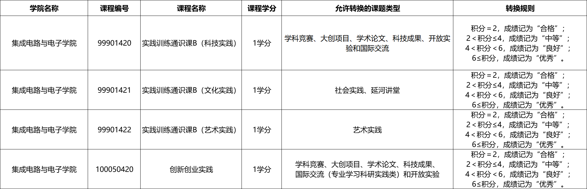

# 集成电路与电子学院
我们所在的集成电路学院分为微波与太赫兹技术研究所、MEMS 与智能微系统研究所、信号与图像处理研究所、柔性电子器件与智造研究所、射频技术与软件研究所、微电子技术研究所、智能电子信息系统研究所、集成微纳电子科学研究所。本科后期的专业课通常由这些研究所的老师教授，小学期的每一个方向一般都对应一个研究所，毕设也由各研究所的老师组织申报与审核。了解这些研究所与老师对大四和研究生阶段都很必要。

## 方向介绍

集成电路大致可以分为五个方向：IC设计、半导体制造工艺、电子设计自动化（EDA）、封装与测试、半导体设备与材料。

- **IC设计** - IC设计可以分为模拟与混合信号、射频(RFIC)、和数字这三大类。

    - **模拟与混合信号** - 虽然是模拟与混合信号，但主要还是研究模拟信号，外加一小部分数字算法。这类电路主要包括电源管理芯片（PMIC），模数/数模转换器 (ADC/DAC)，高速接口电路 (SerDes)。PMIC因其"相对"大量的就业岗位又被称为"源神"。模数转换器（ADC）被誉为模拟电路皇冠上的明珠（留给我们的明珠不多了）。SerDes是高速数字电路与模拟电路的结合体。目前高端的ADC和SerDes仍被国外大厂例如TI、ADI、Marvell等巨头垄断。模拟与混合信号电路设计极度依赖经验，入门门槛较高，很多参数的设计大多依赖于经验公式，而非理论推导，因此需要大量的实战经验积累。要想学好这一方向，需要在实践中培养自己的 **intuition**。

    - **射频(RFIC)** - 最"玄学"的领域。由于射频信号大多在几十Ghz到几百Ghz，当信号的波长与器件的尺寸相比拟的时候，我们需要考虑的就很多了，与传统的低频电路设计有很大区别。射频电路设计主要包括低噪声放大器(LNA)、功率放大器(PA)、混频器(Mixer)、振荡器(Oscillator)、锁相环(PLL)等模块以及基于这些模块构建的收发机系统。射频电路的设计更看重无源器件的设计，例如电感、电容、传输线等。（编者注：RFIC就业岗位极少、行业极度内卷，如非热爱不建议入行）。

    - **数字** - 这是一个热门方向, 工作多点（当然本科毕业是没人要的）。

        - **数字前端** - 从spec到RTL, 大家都只会这点, 包括各种芯片, 做啥写啥
        - **中端** - 从RTL到网表, 包括综合、LEC、STA、DFT
        - **数字后端** - 从门级网表到GDSII, 包括布局规划, 布局, 时钟树综合, 布线, 签核
        - **数字验证** - UVM (用systemVerilog)

- **半导体制造工艺** - 这个方向可以参考《集成电路制造技术》、《MEMS与传感器》、《纳米电子器件》等课程。学完这些课程你应该对集成电路制造工艺有一个比较系统的了解。这个方向的就业岗位主要在各大晶圆厂，例如中芯国际等[^1]。如果你有志于解决国家的卡脖子技术，这个方向是不错的选择。这里还有一个比较特殊的方向：功率器件。主要包括碳化硅(SiC)、氮化镓(GaN)等宽禁带半导体器件。功率器件一般设计和制造工艺是紧密结合的。但有别于传统IC设计，设计师需要通过 TCAD 仿真，去设计沟槽（Trench）有多深、掺杂浓度怎么分布、漂移区有多厚等。目前国内这个赛道竞争激烈。

- **EDA** - 这是个很有趣的方向。你既要懂得集成电路设计的原理，又要有很强的编程能力。EDA方向的工作主要是开发各种EDA工具，例如综合工具、布局布线工具、验证工具等。比方EDA三巨头：Synopsys、Cadence、Siemens。目前EDA软件的一大趋势是AI化，所以多学一些AI相关的知识有助于你在这个方向的发展。如果你对交叉学科感兴趣，这个方向是不错的选择。

- **封装与测试** - 据我所知北理工的这个专业是开设在物理学院的，因此集电的学生可能对此了解不多[^2]。事实上，封装与测试是集成电路产业链中非常非常重要的一环，在先进工艺中大致可以占到整个芯片成本的30%到50%。随着摩尔定律的放缓，先进封装成为了提升性能的关键，例如2.5D/3D 封装、Chiplet (芯粒)、CoWoS 技术。可以说，目前芯片性能的提升有相当大一部分是靠封装技术实现的。如果你对材料、物理感兴趣，这个方向是不错的选择。

- **半导体设备与材料** - 这个方向主要研究半导体制造过程中使用的各种设备和材料。半导体设备包括大家熟知的光刻机、刻蚀机、离子注入机、化学气相沉积(CVD)设备等。这些是我们真正被卡脖子的设备。目前国内在有些设备上已经取得了一些突破，但一些核心设备仍然依赖进口。半导体材料主要包括硅(Si)、砷化镓(GaAs)、氮化镓(GaN)、碳化硅(SiC)等半导体材料以及光刻胶、掺杂源气体等功能性材料。如果你对物理、化学、机械、光学等方向感兴趣，这个方向是不错的选择。

当然转行也很好

- **嵌入式** - 这也很热门, 计算机的都转进来呢
    - **FPGA** - 适合玩手机
    - **做机器人和具身智能的**
- **转码** - 正道!

## 专业学习
我们学校的课程设置为学年制，培养方案不能随意调整，但在就读期间可能会发生变化。

课程分为公共基础课程、专业基础课程、专业课、校公选课、实践环节与体育课。前三项为必修预置课程，后三项为选课。校公选课的学分要求没有写在培养方案中，而是由书院向班级单独通知，其成绩目前不计入保研成绩但计入成绩单[^3]。实践环节即两次小学期课程。另有一门 1 学分的创新创业实践课，虽未写入培养方案但为必修，只能在大四通过素质教育积分转换抵学分。

### 微电子科学与技术

### 电子科学与技术

### 电子科学与技术（全英文）

下面所说的“专业课”指专业基础课程与专业课的合并讨论。与中文班不同，电子科学（全英）课程不可自由选修——不管你修了多少学分，课程安排不能更改。

上课前最好先弄清课程所在的知识体系与业界位置。

我们的专业课程大致可分为四条线路：集成电路、嵌入式、微纳科学与器件、微波与通信。

专业课程总体较少。如果你早早希望在某一方向发展，应尽早取舍并补充该方向知识。很多人选择做数字 IC，部分原因是该方向较容易自学入门[^4]。但这并不是电科专业的唯一主流方向。

这个分类仅限于我们的知识体系，不一定全面。但可以确定的是，每一类课程/线路背后都有更多内容等你去发掘。很多课程只是入门或导论，你需要自行补充更前沿、更具体的内容。

## 可选的课程
关于选课：

- 素质教育积分的来源主要分为 9 类：学科竞赛、大创项目、学术论文、科技成果、开放实验、社会实践、艺术实践、国际交流和“延河讲堂”。其中学科竞赛、学术论文、科技成果类积分需依据学院、书院的积分细则在教务系统中申报；开放实验类、国际交流、“延河讲堂”类积分由教务部录入；大创项目类积分由学生创新创业实践中心录入；社会实践和艺术实践类积分由校团委录入。每年约在 11 月进行申报与认定，详情见《北京理工大学素质教育积分管理办法》。

- 公选课学分要求见下图（公选课学分说明）。年级越高，抽签难度越小；若抽签未中，可以私下联系老师或在第一周关注退课机会。但对于大四在中关村校区或有其他计划的同学，建议前三学年修完公选课，因为中关村校区的公选课种类较少、选课竞争激烈。公选课给分普遍较高，建议选课前关注往年评分与评价[^5]。素质教育积分可于 12 月在教学一体化平台上转换为公选课学分。具体参考《2024-2025 学年第一学期北京理工大学素质教育积分转学分工作流程》。

- 小学期分别在大二上（8–9 月）、大三上（12 月–次年 1 月），其课程难度与平日课程相当。大二上小学期即 EECS 实习。大三上的小学期通常分为电路与电子线路（微电子技术研究所）[^6]、信号与信息处理（信号与图像处理研究所）、电磁场与微波（微波与太赫兹技术研究所）、人工智能技术（射频技术与软件研究所）四个方向，开学时选定。

- 专业实习为大四 8–9 月的小学期，理论上可用实习证明抵掉（但需妥善解释离校实习事宜）。专业实习分为微电子所（IC 方向）、信号所（信号、图像处理、具身智能）、微波所（EECS、电磁仿真）三类。信号所通常会组织各实验室讲座，微电子所会邀请企业授课并安排 RTL/上手练习，微波所则提供相关讲座以夯实基础。

- 开放实验一般围绕竞赛/项目展开，无硬性要求。但若素质教育积分不足（2 分为合格，6 分为优秀），无法兑换“创新创业实践”课程 1 学分，则需报名开放实验补足积分。积分获取途径为竞赛、大创与开放实验，不包括社会实践。

- 体育课共计 4 门，每门 0.5 学分，建议在前两学年修完。体育课评分高度依赖授课老师风格。注意：身体综合训练课程仅在体测不合格时选修，且评分严格，建议不要主动选择。

## 毕业设计
毕业设计为大四上学期开始、下学期结束的大型项目，由校内导师指导，学生与导师共同商讨题目并完成项目。

根据需要提交的材料，毕业设计可分为以下阶段：

- **申报题目（提交任务书）** — 11 月联系校内导师，商讨题目并撰写毕设任务书（包括项目背景、内容与要求），由指导老师在 11 月 29 日前提交。任务书无需在此阶段包含详尽文献调研或明确实现方法；许多学院允许在开题前修改任务书。如不打算自行选题，可跳过此步。理论上 12 月 1 日完成题目申报与审核。

- **双选（提交任务书）** — 12 月在毕设管理系统进行双选。已联系好的题目通常为走形式；未联系的情况只能选择系统公布的题目，选择余地可能较小。每位老师最多带 5 个毕设题目，若联系过晚可能被调剂到不合意的老师或题目。

- **开题（提交开题报告）** — 推免生需在 12 月 31 日前提交，其他学生在 3 月 8 日前提交开题报告（占总分 10%）。开题后需每周向校内外导师报告进展，并向毕设管理系统提交至少 12 次周报作为过程性文件（占总分 10%）。

- **外文翻译与中期报告** — 3 月 10 日前提交外文翻译（占总分 10%，全英专业无需文献翻译），3 月 31 日前完成中期报告（占总分 10%）。到此阶段，多数工作为文献调研与部分仿真。

- **毕业论文与答辩** — 5 月 20 日前提交论文进行盲审；6 月初进行答辩（占总分 60%，全英专业为 70%）。

自行定题来源包括校外毕设（研究生院或企业）、将现有大创/竞赛项目升级为毕设、或拿现有项目改写并寻找校内导师挂名。团队大创或竞赛项目可申请团队毕设，各成员负责项目中的一部分。

全英文专业的毕业设计全过程文件（任务书、开题报告、周报、答辩材料与毕业论文）均需用英文撰写。

[^1]: 就业门槛比较低
[^2]: 北理的电子封装技术专业在全国排名很高
[^3]: 除公选课外，所有课程成绩均计入保研成绩。
[^4]: 如果你要做 IC 设计，建议自学；我校从事设计类教学与指导的老师较少，实战经验可能有限。
[^5]: 参考： [https://docs.qq.com/sheet/DREVzeFlXWG5FTHlr](https://docs.qq.com/sheet/DREVzeFlXWG5FTHlr)
[^6]: 部分小学期内容参考： [https://docs.qq.com/doc/DWEpEVkt3b1pDWkNB](https://docs.qq.com/doc/DWEpEVkt3b1pDWkNB)

